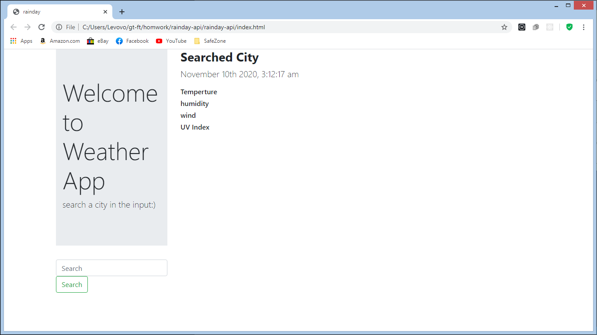

# rainday-api

This application was created for review for the Georgia tech bootcamp.

This basic weather app works by typing the City that was you want look up and press the search button to show that citys weather for that day
theres is no known bugs that occure when using the app

//code talk
The Html file is a basic boilerplate

//script.js
first thing youll see on the `script.js' file the query selector function targeting the document.
The next function is called searchWeather with a perameter called town. what that function perameter does is makes a make a api call to the public weather api.
By using Asynchronous JavaScript and XML aka "ajax call"
I was able to cominicate back ond forth with the public api.

Then was able to capture the resonse in a variable and, access its propertys and was able to display the abject properties by using jquerry dynamic object manipulation
by targeting the created classes and id in the html and changing the text and placing the
responce propertys like weather, temp, humidity.

//lines 25-31
The last block of code is a event listener targeted on the search button to listen to a click. a variable called 'searchtown' to capture using .val() function
on the input span on the app. then added the searchtown to a perameter in 'searchWeather function'.

[this is the link to the page]()
